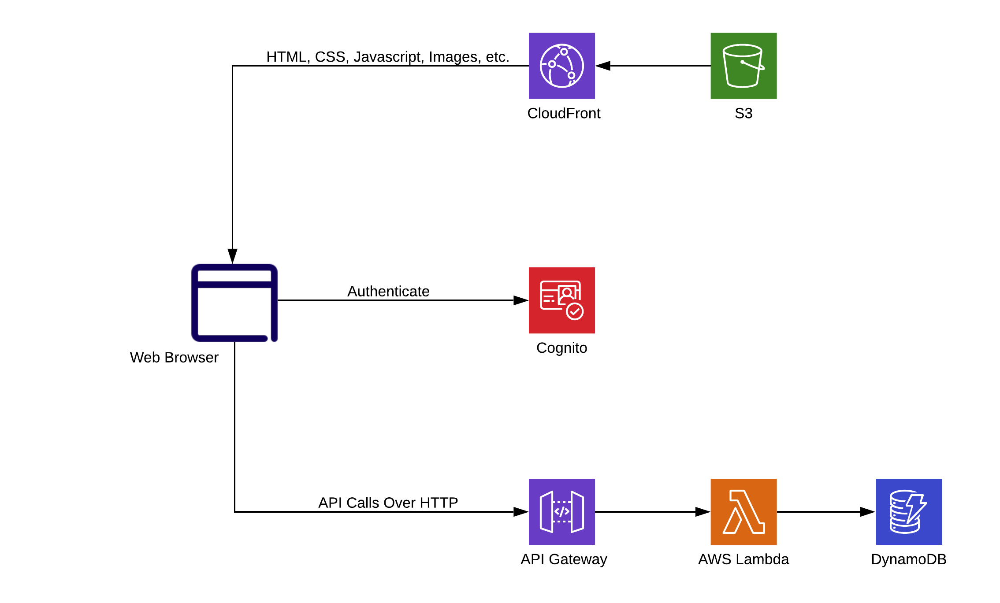

===================================
Onica.create() - Serverless Development on AWS - Labs
===================================
In this series of labs, you will learn how to build and deploy a full-stack Serverless application using Onica best practices. We will also explore concepts and tools for building modern, distributed Serverless systems.

The diagram below shows what will be building throughout the labs.

.. toctree::
   :maxdepth: 2
   :caption: Contents

   01
   02
   03
   04
